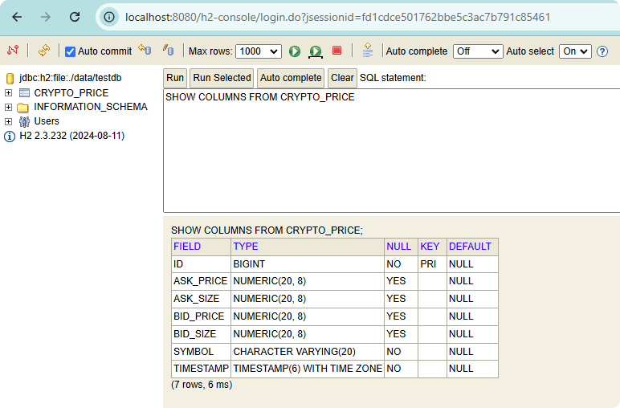

# Notes
- H2 is set to persists across SpringBoot restarts currently. This can be modified in `application.properties` file.

## Swagger API documentation

After starting the application, access the swagger doc via this link http://localhost:8080/swagger-ui/index.html

# Starting the application
- Run `mvn clean install` or Reload pom.xml dependencies from IntelliJ
- Run the `CryptoTradingSystemV2Application` class
- To view the DB, go to http://localhost:8080/h2-console/login.jsp 
	- Example username and password are found in `application.properties` file

## Useful SQL Commands to query H2 DB

```sql
SELECT * FROM CRYPTO_PRICE;
SELECT * FROM CRYPTO_PRICE order by TIMESTAMP DESC LIMIT 50;  

SELECT * FROM WALLET;
```

```sql
SHOW COLUMNS FROM CRYPTO_PRICE; 
```



## Reference data sources 

- Binance: https://api.binance.com/api/v3/ticker/bookTicker
- Huobi https://api.huobi.pro/market/tickers
- Coinbase
- OKX 
- Bybit 
